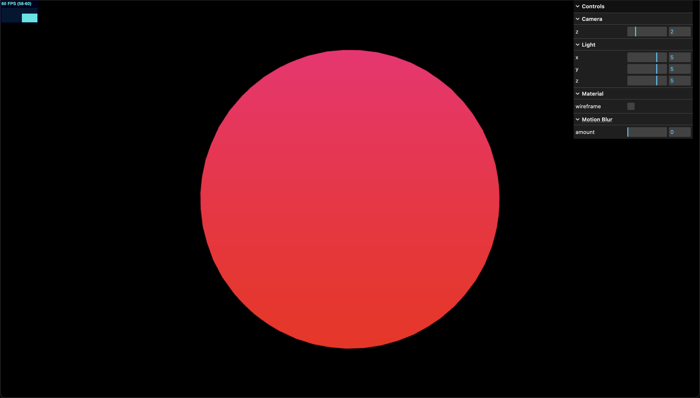

# Three.js Shader Starter

Simple starter project for three.js with shaders.

Inspired from: [shaders-crash-course](https://github.com/visionary-3d/shaders-crash-course)



## Tech Stack

- Three.js
- Vite
- TypeScript
- GLSL

> This project includes utility functions for rendering, camera, light, effect composer, post-processing, tick, and shaders.

## Getting Started

> ![IMPORTANT]
> You can use your favorite package manager instead of `bun`. Just replace `bun` with `npm` or `yarn` or `pnpm` or any other package manager.

```bash
# Clone the repository
git clone https://github.com/rudrodip/shader-template.git

# Change the directory
cd shader-template

# Install dependencies
bun install

# Start the development server
bun run dev
```

## Build

```bash
bun run build
```

## Folder Structure

```bash
├── src
│   ├── render
│   │   ├── init.ts
│   │   └── tick-manager.ts
│   ├── shaders
│   │   ├── fragment.glsl
│   │   └── vertex.glsl
│   ├── app.ts
│   ├── index.ts
│   ├── index.html
│   ├── style.css
```

## License

This project is licensed under the MIT License - see the [LICENSE](./LICENSE.md) file for details.

## Acknowledgements

This project is inspired by [shaders-crash-course](https://github.com/visionary-3d/shaders-crash-course) repository.

I am personally not a big fan of webpack, so I decided to create a similar project with Vite. And I prefer TypeScript over JavaScript.
